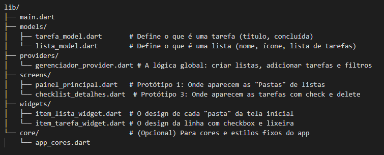

# APP_TAREFAS

## 📝 To-Do List App 
Um aplicativo de gerenciamento de tarefas desenvolvido em Flutter que permite organizar seu dia a dia em listas temáticas com persistência local de dados.

🚀 Funcionalidades
Criação de Listas: Organize suas tarefas por categorias (ex: Mercado, Trabalho, Estudos).

Checklist: Marque e desmarque tarefas com atualização em tempo real na interface.

Persistência Local: Os dados não somem ao fechar o app! Tudo é salvo no Aplicativo usando shared_preferences.

Exclusão de Itens na Lista: Remova tarefas individualmente para manter suas listas limpas.

🛠️ Tecnologias Utilizadas

Flutter & Dart.

Provider: Gerenciamento de estado global.

Shared Preferences: Persistência de dados local.

JSON.

Estruturas de pastas

;
